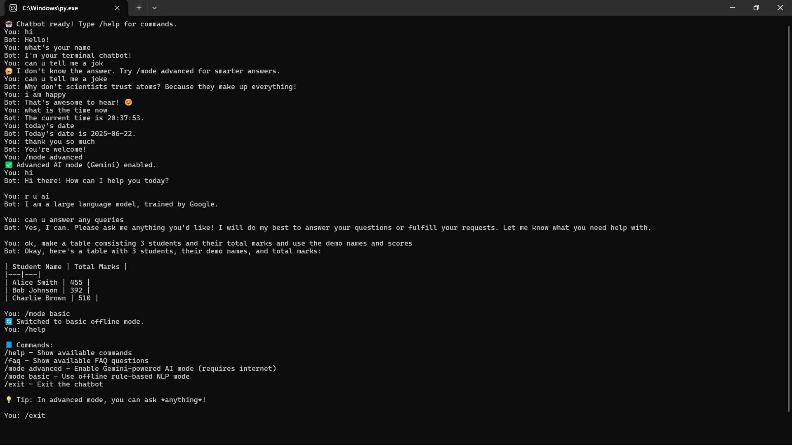

# AI CHATBOT WITH NLP

COMPANY : CODTECH IT SOLUTIONS

NAME : NIRAJ KUMAR YADAV

INTERN ID : CT04DF2492

DOMAIN : PYTHON PROGRAMMING

DURATION : FOUR WEEKS

MENTOR : NEELA SANTHOSH KUMAR

---

# 🤖 AI Chatbot with NLP and Gemini API

A terminal-based chatbot powered by **spaCy**, rule-based NLP, and optionally the **Gemini API** for intelligent responses. This project supports both offline mode (basic logic and FAQs) and advanced AI mode (internet-enabled smart answers).

---

## 🚀 Features

- ✅ Rule-based NLP for greetings, jokes, emotional detection, basic questions  
- 🔍 FAQ engine powered by a simple `faqs.json` file  
- 📅 Responds with current date/time  
- 😂 Built-in programming jokes!  
- 🧠 Advanced mode: Ask **anything** using **Gemini API**  
- 📁 Terminal-based, no web UI — great for internships or system-based bots  
- 🔐 Uses `.env` to store your **GOOGLE_API_KEY** securely  

---

## 🖼️ Screenshot



---

## 📁 Project Structure

```
.
├── ai_chatbot_with_nlp.py
├── faqs.json
├── .env            # U can get Google api key From https://aistudio.google.com/app/apikey
├── README.md
├── requirements.txt
├── OUTPUT_Screenshot/            
    └── S1.png
```

---

## 📌 Dependencies

Install the required library using:

```bash
pip install spacy requests python-dotenv

```

Or use the `requirements.txt`:
```bash
pip install -r requirements.txt
```

### `requirements.txt`
```
spacy
requests
python-dotenv

```

Download the Language Model using:

```bash
python -m spacy download en_core_web_sm
```

---

## 📄 How to Use

1. **Prepare .env file to use Advanced_Mode**  
   Fill the GOOGLE_API_KEY in .env by signing-in in https://aistudio.google.com/app/apikey

2. **Run the script**:
   ```bash
   python ai_chatbot_with_nlp.py
   ```

3. **Output**:
   A CLI-app will appear... where U can chat with limited nlp (coded) queries but U can use advanced mode by typing "/mode advanced" which is basically a integrated GOOGLE AI STUDIO feature. 

---

## 🧾 Output Example (Must Read!! to know the possible queries)

🤖 Chatbot ready! Type /help for commands.
You: hi
Bot: Hey!
You: hello
Bot: Hi there!
You: what is your name
Bot: I'm your terminal chatbot!
You: /help

📘 Commands:
/help - Show available commands
/faq - Show available FAQ questions
/mode advanced - Enable Gemini-powered AI mode (requires internet)
/mode basic - Use offline rule-based NLP mode
/exit - Exit the chatbot

💡 Tip: In advanced mode, you can ask *anything*!

You: joke
Bot: What do you get if you cross a cat with a dark horse? Kitty Perry.

You: tell me a joke
Bot: C and C++ went to a five star bar, C was stopped by the gate guards because C got no class.

You: weather
Bot: I can't check the weather offline, but you can try /mode advanced!

You: sad
Bot: I'm here for you. Things will get better!

You: i am happy
Bot: That's awesome to hear! 😊

You: thank you
Bot: You're welcome!

You: current time
Bot: The current time is 20:29:19.

You: what is today's date
Bot: Today's date is 2025-06-22.

You: my name is niraj
🤔 I don't know the answer. Try /mode advanced for smarter answers.

You: /mode advanced
✅ Advanced AI mode (Gemini) enabled.

You: hi
Bot: Hi there! How can I help you today?

You: who r u
Bot: I am a large language model, trained by Google.

You: so can u access the real world information and get it delivered here        
Bot: As a large language model, I can access and process real-world information through Google Search and other Google tools. When you ask me a question, I use these tools to find relevant information from the internet and other sources. I then synthesize that information and present it to you in a coherent and understandable way.

Think of it like this: I don't *store* all the world's information. Instead, I know *how to find* the information you need and present it to you.

So, yes, I can access real-world information and deliver it to you here. However, there are a few important things to keep in mind:

*   **Accuracy:** While I strive for accuracy, the information I provide is only as accurate as the sources I use. I may sometimes present outdated or inaccurate information. It's always a good idea to double-check critical information with reputable sources.
*   **Bias:** The information I find can be influenced by the biases present in the sources I use. I try to be aware of and mitigate these biases, but they may still be present.
*   **Real-time:** I don't have real-time access to *everything*. While I can often provide up-to-date information, there may be delays depending on the source. For truly real-time information (e.g., live stock prices), you should consult dedicated sources.
*   **Limitations:** I cannot access information behind paywalls or on private networks.

**In summary, I can access and deliver real-world information, but it's important to be aware of my limitations and to use critical thinking when evaluating the information I provide.**

What information are you looking for? I'll do my best to find it for you.

You: hey r u open source         
Bot: I am a large language model, trained by Google. I am not open source.

You: what?
Bot: Is there anything specific you'd like to ask or talk about? I'm ready to answer questions, provide information, or just chat. Let me know what's on your mind!

You: make a joke related to programmers
Bot: Why do programmers prefer dark mode?

Because light attracts bugs!

You: /exit
👋 Goodbye!

---

## 👨‍💻 Author

Developed by **NIRAJ KUMAR YADAV**